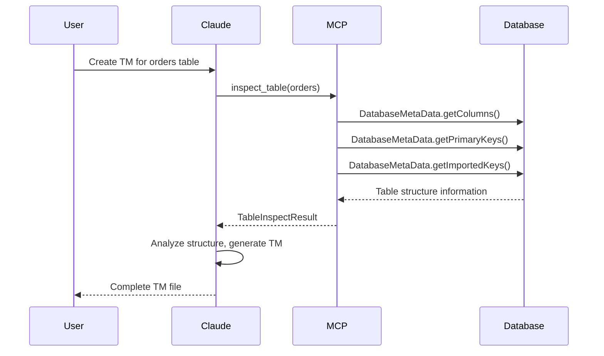

# inspect_table Tool

The `dataset.inspect_table` tool is used to directly retrieve table structure metadata from the database, assisting AI in generating TM/QM model files.

## Feature Overview

This tool retrieves real table structure information from the database through JDBC DatabaseMetaData API, including:

- Column information (name, type, length, nullable)
- Primary key information
- Foreign key relationships
- Index information
- Inferred TM type mappings

## Use Cases

```
User: "Help me create a TM file for the orders table"
AI:   [Call dataset.inspect_table to get table structure]
      [Generate TM file based on returned metadata]
```

## Parameter Description

| Parameter | Type | Required | Description |
|-----------|------|----------|-------------|
| `table_name` | string | Yes | Table name to inspect |
| `schema` | string | No | Database Schema (optional, defaults to connection's default Schema) |
| `data_source` | string | No | Spring Bean name (optional, uses default data source if empty) |
| `database_type` | string | No | Database type: `jdbc` or `mongo` (optional, default `jdbc`) |
| `include_indexes` | boolean | No | Whether to include index information (default false) |
| `include_foreign_keys` | boolean | No | Whether to include foreign key relationships (default true) |
| `include_sample_data` | boolean | No | Whether to include sample data for dictionary inference (default false, max 10 rows) |

## Return Structure

```json
{
  "table_name": "fact_sales",
  "schema": "ecommerce",
  "catalog": "mydb",
  "comment": "Sales fact table",

  "columns": [
    {
      "name": "sales_key",
      "sql_type": "BIGINT",
      "jdbc_type": -5,
      "tm_type": "BIGINT",
      "length": 20,
      "precision": 20,
      "scale": 0,
      "nullable": false,
      "auto_increment": true,
      "default_value": null,
      "comment": "Primary key",
      "is_primary_key": true,
      "suggested_role": "property"
    },
    {
      "name": "customer_key",
      "sql_type": "INT",
      "jdbc_type": 4,
      "tm_type": "INTEGER",
      "length": 11,
      "nullable": false,
      "is_foreign_key": true,
      "references": {
        "table": "dim_customer",
        "column": "customer_key"
      },
      "suggested_role": "dimension"
    },
    {
      "name": "sales_amount",
      "sql_type": "DECIMAL",
      "jdbc_type": 3,
      "tm_type": "MONEY",
      "precision": 12,
      "scale": 2,
      "nullable": false,
      "suggested_role": "measure",
      "suggested_aggregation": "sum"
    }
  ],

  "primary_key": {
    "name": "PRIMARY",
    "columns": ["sales_key"]
  },

  "foreign_keys": [
    {
      "name": "fk_customer",
      "column": "customer_key",
      "references_table": "dim_customer",
      "references_column": "customer_key",
      "suggested_dimension_name": "customer"
    },
    {
      "name": "fk_date",
      "column": "date_key",
      "references_table": "dim_date",
      "references_column": "date_key",
      "suggested_dimension_name": "salesDate"
    }
  ],

  "indexes": [
    {
      "name": "idx_date_customer",
      "columns": ["date_key", "customer_key"],
      "unique": false
    }
  ],

  "suggested_model_type": "fact",
  "suggested_model_name": "FactSalesModel",

  "tm_template": "// TM template automatically generated based on table structure\nexport const model = {\n    name: 'FactSalesModel',\n    ..."
}
```

## Field Role Inference Rules

| Condition | Inferred Role | Description |
|-----------|---------------|-------------|
| Column name contains `_key`, `_id` + has foreign key constraint | `dimension` | Dimension association |
| Column name contains `_key`, `_id` + no foreign key + is primary key | `property` | Local table primary key |
| Type is DECIMAL/NUMERIC + column name contains amount/price/cost/total | `measure` | Amount measure |
| Type is INT + column name contains qty/quantity/count | `measure` | Quantity measure |
| Type is VARCHAR/TEXT | `property` | Text property |
| Type is DATE/DATETIME/TIMESTAMP | `property` | Time property |

## TM Type Mapping

| JDBC Type | SQL Type | TM Type | Description |
|-----------|----------|---------|-------------|
| BIGINT (-5) | BIGINT | `BIGINT` | Long integer |
| INTEGER (4) | INT | `INTEGER` | Integer |
| DECIMAL (3) | DECIMAL | `MONEY` | Amount |
| VARCHAR (12) | VARCHAR | `STRING` | String |
| DATE (91) | DATE | `DAY` | Date |
| TIMESTAMP (93) | DATETIME | `DATETIME` | Date time |
| BOOLEAN (16) | BOOLEAN | `BOOL` | Boolean |

## Permission Control

This tool belongs to the `ADMIN` category:
- **ADMIN** role: Accessible (only via `/mcp/admin/rpc` endpoint)
- **ANALYST** role: Not accessible
- **BUSINESS** role: Not accessible

> Note: Since this tool can directly access database metadata, it is only available to administrators for security reasons.

## Security Considerations

1. **Schema Restriction**: Can configure allowed Schema whitelist
2. **Table Name Filtering**: Can configure table name patterns (e.g., exclude `sys_*`)
3. **Sensitive Column Masking**: Automatically masks columns that may contain sensitive information (password, token, etc.)

## Configuration Example

```yaml
mcp:
  tools:
    - name: "dataset.inspect_table"
      enabled: true
      descriptionFile: "classpath:/schemas/descriptions/inspect_table.md"
      schemaFile: "classpath:/schemas/inspect_table_schema.json"
      category: ADMIN  # Only accessible to administrators

  # Table inspection tool security configuration
  inspect:
    allowed-schemas:
      - public
      - ecommerce
    excluded-tables:
      - "sys_*"
      - "*_log"
    masked-columns:
      - password
      - token
      - secret
```

## Relationship with Existing Tools

| Tool | Data Source | Purpose |
|------|-------------|---------|
| `dataset.get_metadata` | TM/QM files | Query defined model metadata |
| `dataset.describe_model_internal` | TM/QM files | View single model details |
| **`dataset.inspect_table`** | **Database** | **Reverse engineer table structure from database** |

## Workflow Example


